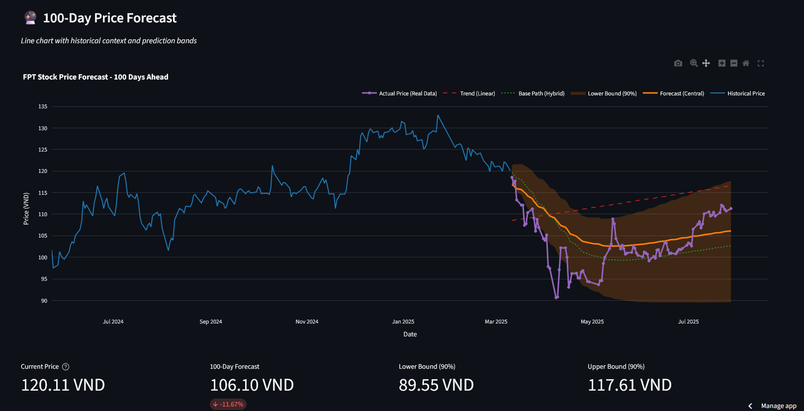
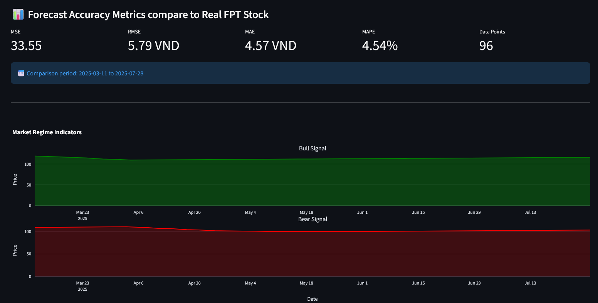
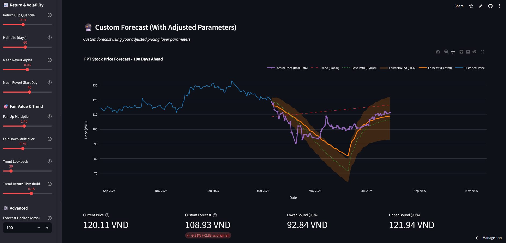
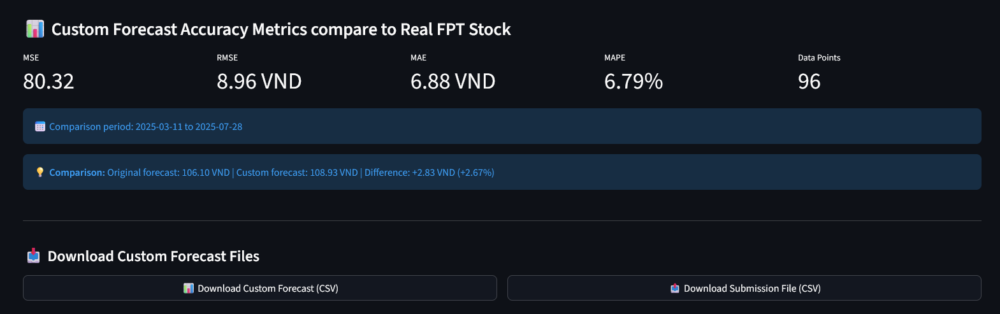
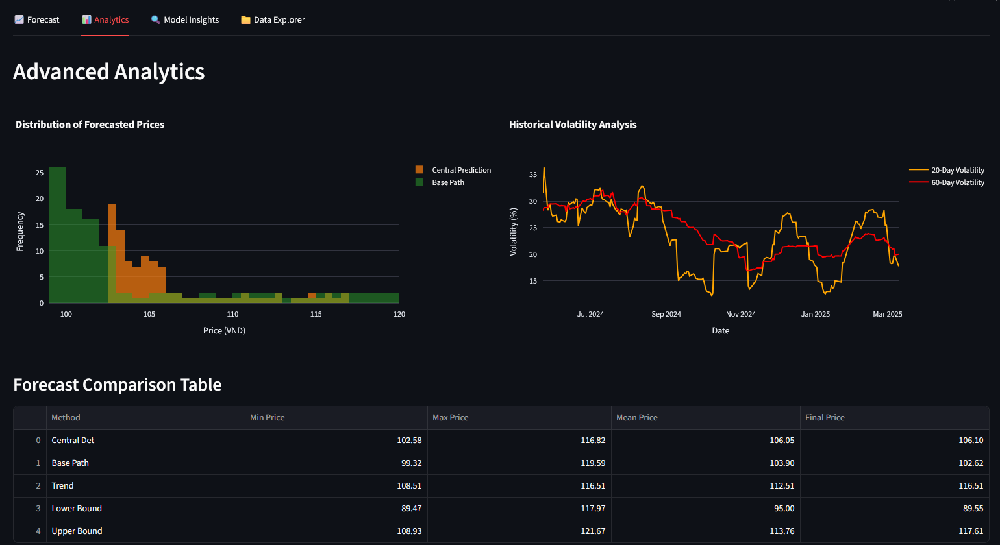
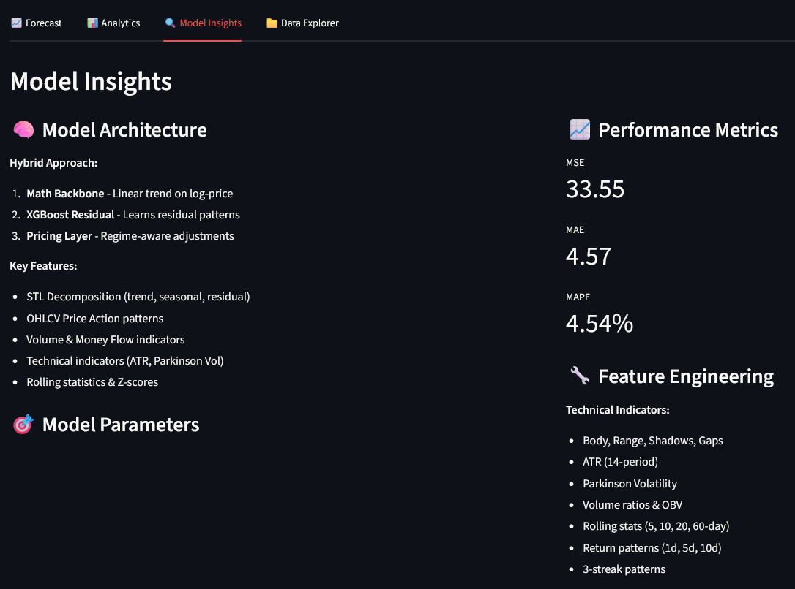

# 📈 FPT Stock Price Forecasting Demo

## Interactive ML-Powered Stock Prediction Dashboard

Welcome to the **FPT Stock Price Forecasting System** - an advanced stock prediction tool that combines mathematical modeling with machine learning to deliver accurate 100-day price forecasts.

---

## 🌟 Key Features

### 1. **Landing Page & Data Visualization**

The dashboard provides an intuitive interface with comprehensive historical data visualization.

**Features:**
- Clean, modern interface with real-time data display
- Multiple visualization modes (Line Chart & Candlestick)
- Configurable timeframes (Daily, Weekly, Monthly, Quarterly)
- Interactive charts with zoom and pan capabilities

---

### 2. **Historical Price Analysis**

View historical price data with professional candlestick charts.

**Capabilities:**
- OHLC (Open, High, Low, Close) visualization
- Volume indicators
- Moving averages (MA20, MA60)
- Customizable timeframe aggregation
- Full 2020-2025 historical data

---

## 🔮 Forecasting Capabilities

### 3. **100-Day Price Forecast**

Get detailed predictions for the next 100 trading days.

**Forecast Components:**
- **Central Prediction**: Main forecast path using hybrid ML model
- **Base Path**: Mathematical backbone prediction
- **Trend Line**: Linear trend projection
- **Uncertainty Bands**: 90% confidence intervals

---

### 4. **Candlestick Forecast View**

Visualize forecasts in candlestick format for better market insight.

**Benefits:**
- Pattern recognition in predicted movements
- Support/resistance level identification
- Aggregated weekly/monthly views
- Professional trader-friendly format

---

## ✅ Real Data Validation

### 5. **Forecast Accuracy with Real Data Overlay**

Compare predictions against actual market prices to validate model accuracy.

**Accuracy Metrics Displayed:**
- **MSE** (Mean Squared Error)
- **RMSE** (Root Mean Squared Error)
- **MAE** (Mean Absolute Error)
- **MAPE** (Mean Absolute Percentage Error)
- Number of overlapping data points
- Comparison date range

---

## 🎛️ Custom Parameter Tuning

### 6. **Custom Forecast with Adjusted Parameters**

Fine-tune the pricing layer parameters to generate customized forecasts.

**Adjustable Parameters:**
- Forecast horizon
- Return clipping quantile
- Half-life days
- Mean reversion alpha
- Fair value multipliers
- Trend detection settings

**Real-time Comparison:**
- Side-by-side comparison with original forecast
- Accuracy metrics for custom predictions
- Download options for custom forecast files

---

### 7. **Download Custom Results**

Export your custom forecasts for further analysis.

**Available Downloads:**
- Custom forecast CSV files
- Custom parameters JSON configuration
- One-click download buttons

---

## 📊 Advanced Analytics

### 8. **Performance Metrics & Analytics**

Deep dive into forecast performance and statistical analysis.

**Analytics Include:**
- Price distribution histograms
- Historical volatility analysis (20-day, 60-day)
- Forecast comparison tables
- Min/Max/Mean/Final price statistics
- Multiple prediction method comparisons

---

## 🔍 Model Insights

### 9. **Technical Documentation & Model Details**

Understand the technology behind the predictions.

**Key Information:**
- **Hybrid ML Architecture**: Math Backbone + XGBoost Residual Learning
- **Feature Engineering**: Technical indicators, regime detection, volatility metrics
- **Training Details**: Dataset size, validation strategy, feature importance
- **Model Architecture**: 3-layer approach (Mathematical, ML, Pricing)
- **Performance Metrics**: Historical accuracy, confidence intervals

**Technical Stack:**
- XGBoost for residual learning
- Pandas & NumPy for data processing
- Plotly for interactive visualizations
- Streamlit for web interface

---

## 🚀 How It Works

### The Hybrid ML Approach

1. **Mathematical Backbone**
   - Exponential weighted moving average
   - Mean reversion modeling
   - Volatility estimation

2. **XGBoost Residual Learning**
   - Captures non-linear patterns
   - Learns from prediction errors
   - Technical indicator integration

3. **Pricing Layer**
   - Fair value adjustment
   - Regime-based corrections
   - Risk band calculation

### Uncertainty Quantification

- Analytical uncertainty bands
- Monte Carlo simulations
- Confidence interval estimation
- Risk assessment metrics

---

## 💡 Use Cases

### For Investors
- 100-day price forecasting
- Risk assessment with uncertainty bands
- Multiple scenario analysis
- Historical performance validation

### For Analysts
- Custom parameter experimentation
- Model performance evaluation
- Technical pattern analysis
- Data export for further research

### For Traders
- Candlestick pattern forecasting
- Support/resistance prediction
- Regime detection (bull/bear)
- Multiple timeframe analysis

---

## 🎯 Getting Started

1. **Launch the Dashboard**: Run the Streamlit application
2. **Explore Historical Data**: Review past price movements
3. **View Forecasts**: Check 100-day predictions
4. **Validate Accuracy**: Enable real data overlay
5. **Customize Parameters**: Adjust settings for custom forecasts
6. **Analyze Results**: Review analytics and metrics
7. **Export Data**: Download forecasts for external use

---

## 📈 Model Performance Highlights

- **Historical Accuracy**: Validated against real market data
- **Forecast Horizon**: 100 trading days
- **Prediction Frequency**: Daily updates
- **Confidence Levels**: 90% uncertainty bands
- **Data Coverage**: 2015-2025 (10+ years)

---

## 🔧 Configuration Options

### Display Settings
- Chart type selection (Line/Candlestick)
- Historical timeframe (1D/1W/1M/3M)
- Forecast timeframe (1D/1W/1M/3M)
- Uncertainty band toggle
- Real data overlay toggle

### Pricing Layer Parameters
- Horizon days
- Return clipping
- Half-life decay
- Mean reversion strength
- Fair value boundaries
- Trend detection thresholds

---

## 📊 Data Sources

- **Primary Data**: FPT Corporation stock prices (Vietnam)
- **Real-time Validation**: FPT_realdata.csv
- **Historical Training**: 2015-2025 market data
- **Volume Data**: Trading volume indicators

---

## 🎨 User Interface Features

- **Responsive Design**: Works on all screen sizes
- **Interactive Charts**: Zoom, pan, and explore
- **Real-time Updates**: Live parameter adjustments
- **Download Options**: Export charts and data
- **Dark/Light Themes**: Customizable appearance
- **Tooltips**: Helpful explanations throughout

---

## 🏆 Conclusion

The **FPT Stock Price Forecasting System** combines cutting-edge machine learning with traditional financial modeling to deliver:

✅ Accurate 100-day price predictions
✅ Comprehensive uncertainty quantification
✅ Real-time model validation
✅ Customizable forecasting parameters
✅ Professional-grade visualizations
✅ Export capabilities for further analysis

---

## 🚀 Technology Stack

- **Backend**: Python, Pandas, NumPy, XGBoost
- **Frontend**: Streamlit
- **Visualization**: Plotly
- **Data Processing**: Custom feature engineering pipeline
- **Model**: Hybrid (Mathematical + ML)

---

## 📝 Credits

**Model**: Hybrid ML Approach (Math Backbone + XGBoost Residual Learning + Pricing Layer)
**Data**: FPT Corporation (Vietnam Stock Exchange)
**Forecast Horizon**: 100 Days
**Update Frequency**: Daily

---

THIS IS SO COOL, AHAHAHAHH, COOOL. Practice github 

*Experience the future of stock price prediction with AI-powered forecasting!* 🎯📈
